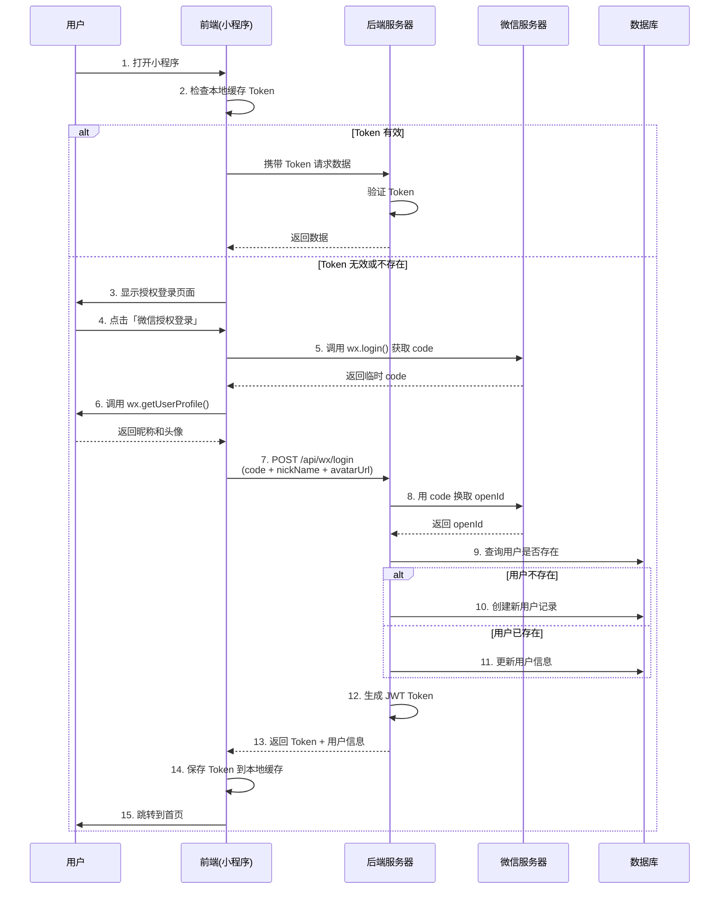

# 微信小程序登录与 JWT Token 认证完整流程

## 📋 目录
- [整体流程](#整体流程)
- [接口文档](#接口文档)
- [前端调用示例](#前端调用示例)
- [后端实现说明](#后端实现说明)

---

## 🔄 整体流程



---

## 📡 接口文档

### 1. 微信登录接口（无需 Token）

**接口地址**: `POST /api/wx/login`

**Content-Type**: `application/json`

#### 请求参数

| 参数名 | 类型 | 必填 | 说明 |
|--------|------|------|------|
| code | String | ✅ 是 | 微信临时登录凭证（通过 wx.login 获取） |
| nickName | String | ✅ 是 | 用户昵称 |
| avatarUrl | String | ✅ 是 | 用户头像 URL |

#### 请求示例

```json
{
  "code": "071ABC123XYZ456",
  "nickName": "张三",
  "avatarUrl": "https://wx.qlogo.cn/mmopen/vi_32/xxx/0"
}
```

#### 响应数据

**成功响应 (HTTP 200)**

```json
{
  "code": 200,
  "message": "登录成功",
  "data": {
    "token": "eyJhbGciOiJIUzI1NiJ9.eyJvcGVuSWQiOiJvWFhYWCIsInVzZXJJZCI6MSwibmlja05hbWUiOiLlsI_pigkiLCJzdWIiOiJvWFhYWCIsImlhdCI6MTcxNDU2Nzg5MCwiZXhwIjoxNzE1MTcyNjkwfQ.xxx",
    "userId": 1,
    "openId": "oXXXX-XXXXXXXXXXXXXXXXXXXXX",
    "nickName": "张三",
    "avatarUrl": "https://wx.qlogo.cn/mmopen/vi_32/xxx/0"
  }
}
```

**失败响应 (HTTP 400/500)**

```json
{
  "code": 400,
  "message": "微信临时code不能为空",
  "data": null
}
```

---

### 2. 获取当前用户信息（需要 Token）

**接口地址**: `GET /api/user/info`

**Headers**: 
```
Authorization: Bearer <your_jwt_token>
```

#### 响应数据

**成功响应 (HTTP 200)**

```json
{
  "code": 200,
  "message": "获取成功",
  "data": {
    "id": 1,
    "openId": null,
    "nickName": "张三",
    "avatarUrl": "https://wx.qlogo.cn/mmopen/vi_32/xxx/0",
    "createTime": "2026-05-01T14:30:00",
    "updateTime": "2026-05-01T14:30:00"
  }
}
```

**未登录响应 (HTTP 401)**

```json
{
  "code": 401,
  "message": "未登录或Token已过期",
  "data": null
}
```

---

### 3. 检查登录状态（需要 Token）

**接口地址**: `GET /api/user/check-login`

**Headers**: 
```
Authorization: Bearer <your_jwt_token>
```

#### 响应数据

```json
{
  "code": 200,
  "message": "检查成功",
  "data": true
}
```

---

## 💻 前端调用示例

### 微信小程序完整代码

```javascript
// app.js
App({
  globalData: {
    userInfo: null,
    token: null
  },

  onLaunch() {
    // 1. 小程序启动时检查本地缓存 Token
    this.checkLoginStatus();
  },

  /**
   * 检查登录状态
   */
  checkLoginStatus() {
    const token = wx.getStorageSync('token');
    const userInfo = wx.getStorageSync('userInfo');

    if (token && userInfo) {
      // Token 存在，验证是否有效
      this.validateToken(token).then(valid => {
        if (valid) {
          console.log('Token 有效，自动登录成功');
          this.globalData.token = token;
          this.globalData.userInfo = userInfo;
          // 跳转到首页
          wx.switchTab({ url: '/pages/index/index' });
        } else {
          console.log('Token 已过期，需要重新登录');
          this.goToLoginPage();
        }
      }).catch(() => {
        this.goToLoginPage();
      });
    } else {
      // 没有 Token，进入登录页面
      console.log('未登录，进入授权页面');
      this.goToLoginPage();
    }
  },

  /**
   * 验证 Token 是否有效
   */
  validateToken(token) {
    return new Promise((resolve, reject) => {
      wx.request({
        url: 'http://localhost:8080/api/user/check-login',
        method: 'GET',
        header: {
          'Authorization': `Bearer ${token}`
        },
        success: (res) => {
          if (res.statusCode === 200 && res.data.code === 200) {
            resolve(res.data.data);
          } else {
            resolve(false);
          }
        },
        fail: reject
      });
    });
  },

  /**
   * 跳转到登录页面
   */
  goToLoginPage() {
    wx.reLaunch({
      url: '/pages/login/login'
    });
  }
});
```

```javascript
// pages/login/login.js
Page({
  data: {
    loading: false
  },

  /**
   * 用户点击微信授权登录
   */
  handleWechatLogin() {
    this.setData({ loading: true });

    const app = getApp();

    // 1. 获取微信登录 code
    wx.login({
      success: (loginRes) => {
        if (!loginRes.code) {
          wx.showToast({ title: '获取 code 失败', icon: 'none' });
          this.setData({ loading: false });
          return;
        }

        // 2. 获取用户信息（昵称和头像）
        wx.getUserProfile({
          desc: '用于完善用户资料',
          success: (userRes) => {
            const loginData = {
              code: loginRes.code,
              nickName: userRes.userInfo.nickName,
              avatarUrl: userRes.userInfo.avatarUrl
            };

            // 3. 调用后端登录接口
            this.doLogin(loginData);
          },
          fail: (err) => {
            console.error('用户拒绝授权', err);
            wx.showToast({ title: '需要授权才能使用', icon: 'none' });
            this.setData({ loading: false });
          }
        });
      },
      fail: (err) => {
        console.error('wx.login 失败', err);
        wx.showToast({ title: '登录失败，请重试', icon: 'none' });
        this.setData({ loading: false });
      }
    });
  },

  /**
   * 执行登录请求
   */
  doLogin(loginData) {
    wx.request({
      url: 'http://localhost:8080/api/wx/login',
      method: 'POST',
      header: {
        'Content-Type': 'application/json'
      },
      data: loginData,
      success: (res) => {
        if (res.statusCode === 200 && res.data.code === 200) {
          const { token, userId, openId, nickName, avatarUrl } = res.data.data;

          // 9. 前端把 token、用户信息存入手机本地缓存
          wx.setStorageSync('token', token);
          wx.setStorageSync('userInfo', {
            userId,
            openId,
            nickName,
            avatarUrl
          });

          // 更新全局数据
          const app = getApp();
          app.globalData.token = token;
          app.globalData.userInfo = { userId, openId, nickName, avatarUrl };

          wx.showToast({ title: '登录成功', icon: 'success' });

          // 10. 自动跳转到小程序首页
          setTimeout(() => {
            wx.switchTab({ url: '/pages/index/index' });
          }, 1500);
        } else {
          wx.showToast({ 
            title: res.data.message || '登录失败', 
            icon: 'none' 
          });
        }
      },
      fail: (err) => {
        console.error('请求失败', err);
        wx.showToast({ title: '网络错误，请重试', icon: 'none' });
      },
      complete: () => {
        this.setData({ loading: false });
      }
    });
  }
});
```

```javascript
// pages/index/index.js (首页示例)
Page({
  data: {
    userInfo: null
  },

  onLoad() {
    this.loadUserInfo();
  },

  /**
   * 加载用户信息
   */
  loadUserInfo() {
    const token = wx.getStorageSync('token');
    if (!token) {
      wx.reLaunch({ url: '/pages/login/login' });
      return;
    }

    // 携带 Token 请求用户信息
    wx.request({
      url: 'http://localhost:8080/api/user/info',
      method: 'GET',
      header: {
        'Authorization': `Bearer ${token}`
      },
      success: (res) => {
        if (res.statusCode === 200 && res.data.code === 200) {
          this.setData({ userInfo: res.data.data });
        } else if (res.statusCode === 401) {
          // Token 过期，重新登录
          wx.reLaunch({ url: '/pages/login/login' });
        }
      }
    });
  }
});
```

---

## 🔧 后端实现说明

### 技术栈

- **Spring Boot 3.5.0** - Web 框架
- **Spring Data JPA** - 数据访问
- **MySQL 8.0** - 数据库
- **JWT (jjwt 0.12.6)** - Token 生成与验证
- **Lombok** - 代码简化

### 核心组件

#### 1. JwtUtil - JWT 工具类

负责生成和解析 JWT Token：

```java
@Component
public class JwtUtil {
    // 生成 Token
    public String generateToken(String openId, Long userId, String nickName) { ... }
    
    // 解析 Token
    public Claims parseToken(String token) { ... }
    
    // 验证 Token
    public boolean validateToken(String token) { ... }
}
```

**Token 中包含的信息：**
- `openId` - 微信用户唯一标识
- `userId` - 数据库用户ID
- `nickName` - 用户昵称
- `exp` - 过期时间（默认 7 天）

#### 2. WxLoginService - 登录服务

处理微信登录的核心逻辑：

```java
@Service
public class WxLoginService {
    public WxLoginResponse login(WxLoginRequest request) {
        // 1. 用 code 换取 openId
        String openId = code2OpenId(request.getCode());
        
        // 2. 查询或创建用户
        WxUser user = findOrCreateUser(openId, request);
        
        // 3. 生成 JWT Token
        String token = jwtUtil.generateToken(...);
        
        // 4. 返回 Token 和用户信息
        return buildResponse(user, token);
    }
}
```

#### 3. JwtAuthenticationInterceptor - Token 验证拦截器

自动验证请求中的 Token：

```java
@Component
public class JwtAuthenticationInterceptor implements HandlerInterceptor {
    @Override
    public boolean preHandle(HttpServletRequest request, ...) {
        // 从请求头获取 Token
        String token = request.getHeader("Authorization");
        
        // 验证 Token
        if (jwtUtil.validateToken(token)) {
            // 将用户信息存入请求属性
            request.setAttribute("userId", ...);
            return true;
        }
        
        // Token 无效，返回 401
        response.setStatus(401);
        return false;
    }
}
```

#### 4. WebConfig - Web 配置

注册拦截器，配置哪些接口需要验证 Token：

```java
@Configuration
public class WebConfig implements WebMvcConfigurer {
    @Override
    public void addInterceptors(InterceptorRegistry registry) {
        registry.addInterceptor(jwtAuthenticationInterceptor)
                .addPathPatterns("/api/**")      // 拦截所有 API
                .excludePathPatterns("/api/wx/login");  // 排除登录接口
    }
}
```

### 数据库表结构

```sql
CREATE TABLE `user` (
    id BIGINT PRIMARY KEY AUTO_INCREMENT,
    open_id VARCHAR(100) UNIQUE NOT NULL COMMENT '微信用户唯一标识',
    nick_name VARCHAR(50) COMMENT '用户昵称',
    avatar_url VARCHAR(255) COMMENT '用户头像URL',
    create_time DATETIME NOT NULL COMMENT '创建时间',
    update_time DATETIME NOT NULL COMMENT '更新时间',
    INDEX idx_open_id (open_id)
) ENGINE=InnoDB DEFAULT CHARSET=utf8mb4 COMMENT='微信用户表';
```

### 配置文件

**application.properties**

```properties
# 数据库配置
spring.datasource.url=jdbc:mysql://localhost:3306/restaurant_order_system
spring.datasource.username=root
spring.datasource.password=123456

# JPA 配置
spring.jpa.hibernate.ddl-auto=update
spring.jpa.show-sql=true

# 微信小程序配置
wx.mini.appid=your_appid
wx.mini.secret=your_secret

# JWT 配置
jwt.secret=mySecretKeyForJwtTokenGenerationAndValidation123456789
jwt.expiration=604800000  # 7天（毫秒）
```

---

## 🔐 安全建议

1. **密钥管理**
   - ⚠️ 生产环境必须修改 `jwt.secret` 为强随机字符串
   - ⚠️ 不要将密钥硬编码在代码中
   - ✅ 建议使用环境变量或配置中心管理密钥

2. **HTTPS**
   - ✅ 生产环境必须使用 HTTPS
   - ✅ 微信小程序只支持 HTTPS 接口

3. **Token 有效期**
   - 当前设置为 7 天，可根据业务需求调整
   - 敏感操作可以设置更短的有效期

4. **刷新机制**
   - 可以实现 Refresh Token 机制
   - Token 快过期时自动刷新

5. **防重放攻击**
   - 可以在 Token 中加入时间戳
   - 服务端验证时间戳的有效性

---

## 📝 开发注意事项

### 前端

1. **Token 存储**
   - 使用 `wx.setStorageSync()` 存储 Token
   - 每次请求都要在 Header 中携带 Token

2. **Token 过期处理**
   - 捕获 401 错误
   - 清除本地缓存
   - 跳转到登录页

3. **用户体验**
   - 登录时显示 loading 状态
   - 给出明确的错误提示
   - 避免频繁弹出授权窗口

### 后端

1. **异常处理**
   - 统一异常返回格式
   - 记录详细的错误日志
   - 不暴露敏感信息

2. **性能优化**
   - 可以考虑缓存用户信息
   - 减少数据库查询次数

3. **日志记录**
   - 记录登录成功/失败日志
   - 记录 Token 验证失败日志
   - 便于问题排查和安全审计

---

## 🚀 测试步骤

### 1. 启动后端服务

```bash
mvn spring-boot:run
```

### 2. 配置微信小程序

在 `app.json` 中配置合法域名：
```json
{
  "networkTimeout": {
    "request": 10000
  },
  "setting": {
    "urlCheck": false
  }
}
```

### 3. 测试登录流程

1. 打开微信开发者工具
2. 编译运行小程序
3. 进入登录页面
4. 点击「微信授权登录」
5. 查看控制台输出
6. 检查本地缓存是否有 Token

### 4. 测试 Token 验证

1. 登录成功后
2. 访问需要认证的页面
3. 查看是否能正常获取用户信息
4. 手动删除 Token 后测试是否跳转登录页

---

## ❓ 常见问题

### Q1: Token 有效期是多久？
A: 默认 7 天，可在 `application.properties` 中修改 `jwt.expiration`。

### Q2: Token 被窃取怎么办？
A: 
- 使用 HTTPS 防止中间人攻击
- 实现 Token 黑名单机制
- 缩短 Token 有效期
- 增加设备指纹验证

### Q3: 如何实现退出登录？
A: 
```javascript
// 前端
wx.removeStorageSync('token');
wx.removeStorageSync('userInfo');
wx.reLaunch({ url: '/pages/login/login' });
```

### Q4: 如何刷新 Token？
A: 可以实现双 Token 机制（Access Token + Refresh Token），或在 Token 快过期时自动续期。

### Q5: 多个设备同时登录怎么办？
A: JWT 是无状态的，默认允许多设备同时登录。如需限制，需要实现 Token 黑名单或会话管理。

---

## 📚 参考资料

- [JWT 官网](https://jwt.io/)
- [Spring Security JWT](https://spring.io/projects/spring-security)
- [微信小程序登录文档](https://developers.weixin.qq.com/miniprogram/dev/framework/open-ability/login.html)
- [jjwt GitHub](https://github.com/jwtk/jjwt)

---

## 🎯 下一步优化

1. ✅ 实现 Refresh Token 机制
2. ✅ 添加 Token 黑名单功能
3. ✅ 实现单设备登录限制
4. ✅ 添加登录日志记录
5. ✅ 实现权限控制（RBAC）
6. ✅ 添加 API 限流保护
7. ✅ 实现 OAuth2.0 完整认证流程

---

**完成时间**: 2026-05-01  
**版本**: v1.0.0
